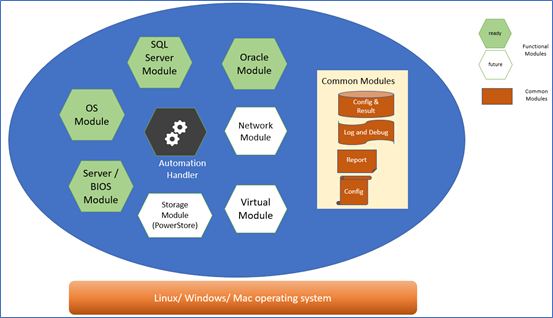
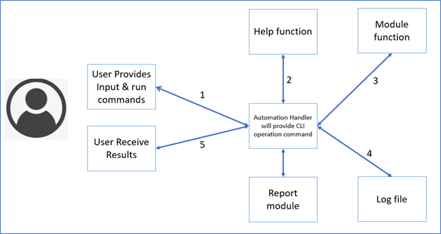
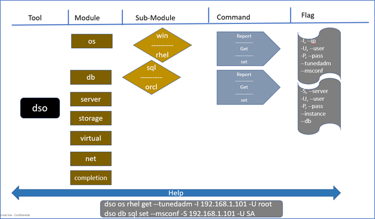

# DSO [Database Solution Optimizer]

### The Database Solution Optimizer (DSO) is a free command line utility/toolkit provided by Dell Engineering to collect, report, and automate the application of best practices. 
### DSO tool benefit includes: 

-	Reporting on the configuration of different layers in the database solution stack. Administrators can quickly generate reports to evaluate if best practices have been implemented.  
-	Automating best practices. The administrator can apply best practices using the toolkit and save time.  
-	The DSO toolkit can be deployed and works on Windows, Linux, and Mac operating systems.  
-	This toolkit collects and displays data in a single format. As of now this tool support displaying/saving data in table, json and csv format.
-	Help and examples for almost all commands and operations is inbuilt within this toolkit.
-	DSO toolkit also provides auto-completion support for PowerShell, Bash Shell and zsh (zee shell)
-	It provides consistent and intuitive command flow which is very much helpful in its usability.
-	This toolkit provides agentless approach for collecting and applying best practices. It does not depend on any external client or tools hence simplifying its setup and maintenance. 

> **_NOTE:_** The DSO toolkit is not a supported product, but it is provided to customers for use and customize their own database environments. 

The DSO toolkit is designed and organized by functional models based on its area of applicability and also follows completely modular approach with minimal or zero dependency.  



As can be seen from above representation, functional components are represented by hexagon and those highlighted in green colors are ready to ship with this release. White colored hexagon represents functional modules that will added to the toolkit in future release.  
There are also some common modules that are shown in brown colors work alongside all functional module and provide required capabilities across modules.  
Black colored Automation handler binds togather all the funtional and common modules.  


### Below sections describe different components in the DSO toolkit: -

## Automation handler
Automation handler is the main component and is the heart and brain of this utility/toolkit. End user will be interacting with this toolkit by the functions and options provided by this handler.  
This handler will also provide help for all modules command and also provide examples for all modules and commands. Followings are some of the tasks carried out by this handler. Automation handler 
-	Will collect the input provided by the end user
-	Perform basic validation check 
-	Call respective module function from different module for the operation to begin.
-	Collect the response and/or error from module functions.
-	Pass relevant data to log module to be captured in the log file.
-	Display result/information/help/error to end user in requested format.

Below diagram showcase the operation flow for DSO toolkit or the automation handler.



As can be seen from above operation flow diagram, following steps occurs within dso tools:
- User will provide command and inputs from the shell 
- Automation handler will receive the command and inputs and will decide on
  - It will parse the input command and flags
  - If the command looking for help, it will fetch help for the given command from help module.
  - If the command looking for log data, it will fetch log records for the dso
  - If the command belongs to GET, SET or REPORT catagories for any functional module, it will intract with corresponding modules and perform the operation required.
- If any error are present in command input, display the error as well as help for that command
- If any error are present during execution, display the error for the user
- Finally, if there are no error, display the outcome of the command to user in requested format.

DSO toolkit also provides consistent and intuitive command flow which is very much helpful in its usability. Below representation showcase the command flow process as: -
```text 
<tool> <module> <sub-module> <command> <flag> <values>
```
Ex: - 	
```bash
dso os rhel report -I xxx.xxx.xxx.xxx -U <username> -P <password>  
```



## Completion Module

To further help with ease of usage, this tool comes up with auto-completion module that requires very minimum configuration from user end.

The dso tool supports auto-completion features for four different shell environment and users with choice for working with shell environment as per their need/requirements:
- [PowerShell](https://docs.microsoft.com/en-us/powershell/scripting/overview?view=powershell-7.2)
- [Bash Shell](https://en.wikipedia.org/wiki/Bash_(Unix_shell))
- [Zsh Shell](https://en.wikipedia.org/wiki/Z_shell)
- [Fish Shell](https://fishshell.com/)

Refer [Install section](../README.md#install-instructions) that covers auto-completion configuration instructions for DSO.


## Reporting Module 
The reporting module is a common module that work in sync with other functional modules. It enables the administrator to collect current configuration values within different layers of the infrastructure. The reporting module allows fast analysis of several configurations within your database solution platform.  

There are two types of reporting structure present in this utility:
- report command -This kind of report have extra relevant details apart from best practices related to specific modules
- get commands: - This kind of report will capture current and recommended values only for best practices related to specific modules

This module will have the logic inbuilt to collect current values for the desired parameters/settings and the recommended values. This way user can validate the present values and could take decision to set the best practice configuration. 

User can also filter report by providing applicable flag to the module so that the report will get generated only for that specific part of the module. For example, if user want to generate report only for OS kernel settings, user can use the command as shown below: -
```bash
dso os rhel report -w sql --tunedadm -I <Ip address> -U <username> -P <password> 
```
if user want to generate report for all functional area of OS RHEL module, it can be done using below command: -
```bash
dso os rhel report -w sql -I <Ip address> -U <username> -P <password> 
```

## Server BIOS Module 
PowerEdge BIOS configuration reports are important to quickly evaluate if the server is optimized for the database workload. This PowerEdge BIOS module uses IDRAC Redfish REST API to pull the BIOS configuration. With this report, an administrator can understate these settings: 
-	System workload profile setting 
-	System profile setting for performance 
-	Status of Integrated Devices 
-	X2APIC Support 
-	Any other user provided settings

The server BIOS module can also update these settings.  
>**Caution:** Make sure there are no applications running on the server when changing any of the BIOS settings. 

Reffer [BIOS module example section] for details about how to use this module with DSO.

## Linux OS Module 
The Linux operating system module allows an administrator to report on the Huge Pages configuration. It also checks several OS kernel settings using a custom Microsoft SQL Server-tuned profile. This profile was created by the Dell engineering team to quickly apply OS settings that improve database performance. The tuned profile is used by the existing Linux tuned-adm tool to:  
-	Report on the differences between the current OS configuration and the settings recommended in the custom Microsoft SQL Server-tuned profile. 
-	Apply the recommended OS configuration changes from the custom tuned profile 
-	Report on mssql-config settings for SQL Server Instance
-	Apply the recommended mssql-config settings

## SQL Server Module 
The Microsoft SQL Server module enable the database administrator to report and apply the different settings at database layer of the solution. These settings could be Instance specific, database specific or specific configuration settings. Some examples of the settings are: -
-	CPU affinity setting
-	Database file growth
-	Min and Max memory setting for SQL Server instance
-	Query optimizer hotfixes setting

>Other settings will be added in this module in future releases of this module/tool.

Apart for the best practice reporting and its application, user also have option to generate general report for the database layer for the inventory purpose.

## Oracle Module 
The Oracle database module enable the database administrator to report and apply the different settings at database layer of the solution. These settings could be Instance specific, database specific or specific configuration settings. Some examples of the settings are: -
-	Increase the number and size of Redo Log file
-	Change High Priority Processes
-	Optimize SGA_Max_size and SGA_Target

>Other settings will be added to this module in future releases of this module/tool.

Apart for the best practice reporting and its application, user also have option to generate general report for the database layer for the inventory purpose.

## Storage Module (future functionality) 
Physical storage configuration and other related settings can be challenging and time-consuming. The storage module reports on the PowerMax storage directors and the storage LUNs. This enables the database administrator to analyze the PowerMax storage configuration and collaborate with the PowerMax administrator.  
The storage module also provides functionality for reporting on ASM and VMware configurations. Here is the full list of capabilities: 
 
-	Reports on storage director ports and interface emulations 
-	Reports and adds storage LUNs  
-	Applying different settings on LUNs as per the requirement.
 
As of now this module is partially complete and provides minimal reporting capabilities for **Dell PowerStore** storage.

## Network Module (future functionality) 
The network module will help working with physical and virtual network component by providing options to report and apply best practice settings. For example, this module will allow reporting on the Maximum Transmission Unit. If supported by the network switch, a maximum MTU of 9,000 will improve network performance and significantly improve actively moving a virtualized database from one server to another.  
 
## Virtual Module (future functionality) 
The virtual module will help working with virtualization component by providing options to report and apply best practice settings. Initially this module will include VMware ESXi sub-module to work with vSphere and vCenter settings. Some of the examples for working with settings related to virtualization layer of the solution includes: -  
VMware 
-	VMware ESXi: Round Robin Path Policy 
-	VMware vSphere: Power Management Policy 
-	VMware ESXi: HBA Queue Depth
-	VMware vSphere: Virtual Machine Latency Sensitivity
-	VMware Storage I/O Control: Threshold

## Log and Debug Module (future functionality) 
Debugging and logging are important functionality for any tools. This module will help capture each and every operation in the toolkit to a log file. The log module will also help formats a report for the administrator to review toolkit usage and its actions. 
