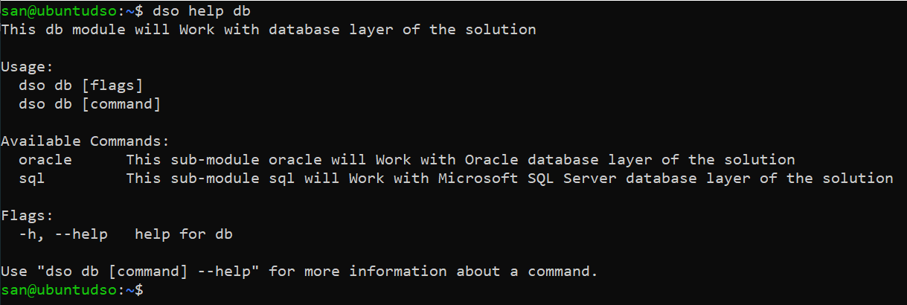

# Help Module

DSO tool comes with inbuilt help command that showcases help about any module, sub-module, or command.  
The help module can be invoked by using any of the below-mentioned formats:
- by adding(-h) to any command
- by adding (--help) to any command
- bypassing any command to help module (dso help command_name)

1 Get help about dso tool
```bash
dso -h
```


OR

```bash
dso --help
```


2 To get help with any module (for ex- db module)
```bash
dso help db 
```


3 To get help about sub-module (for ex- oracle sub-module under db module)
```bash
dso help db oracle
```


4 To get help with any command (for example report command under db module and oracle sub-module)
```bash
dso help db oracle report
```


> **NOTE:** similarly help for any module, sub-module, command can be obtained.

