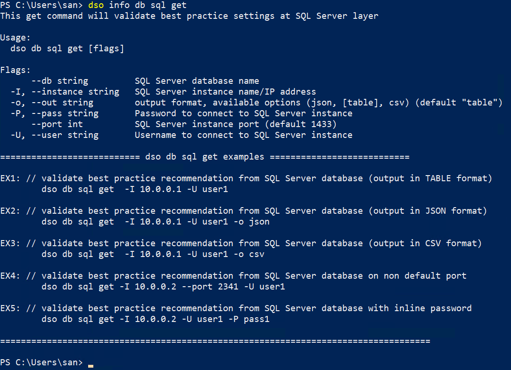
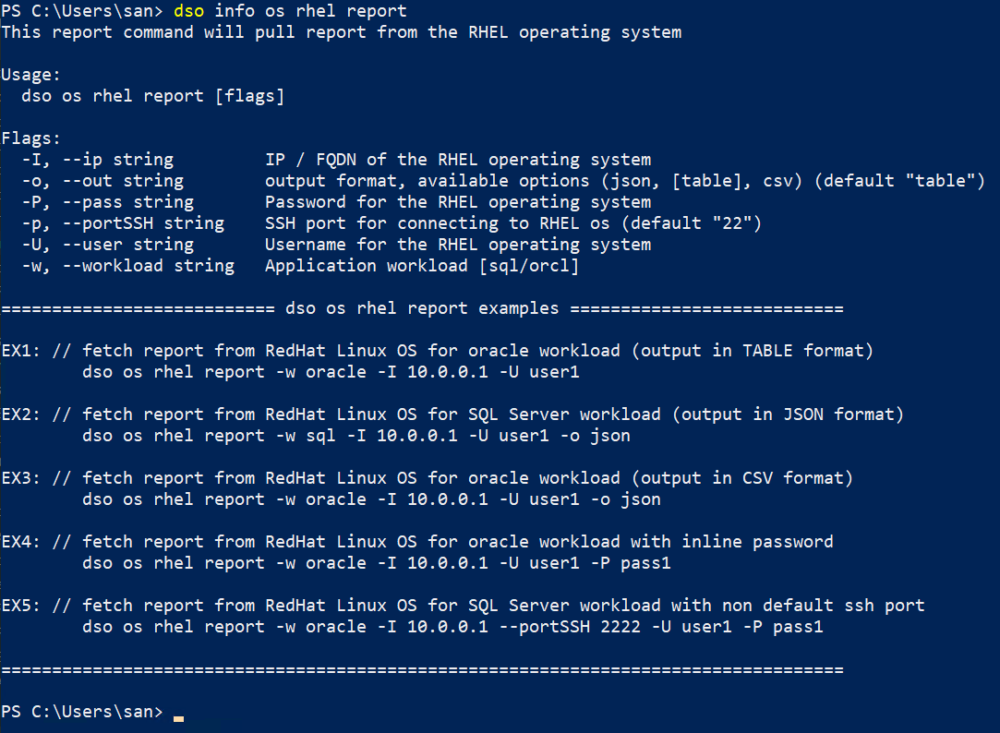

# Info command examples

DSO tool comes with an inbuilt example module which gets accessed by the **info** command.

The info command showcases usage examples of the command along with help about the command. 

> **NOTE:** Info commands showcase examples only for get, set and report commands for each module and sub-module. For module and sub-module, it displays only help about that module.

<br>

**info** command uses the following syntax format to display the details:
```
dso info <module> <sub-module> <command> 
```
For ex:-
```bash
dso info db sql get 
```


or
```bash
dso info os rhel report 
```

